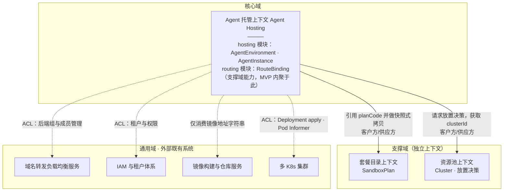
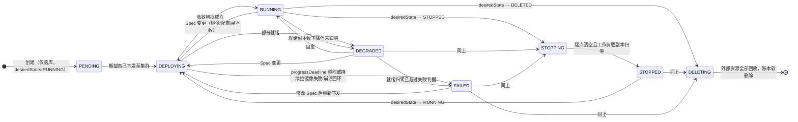
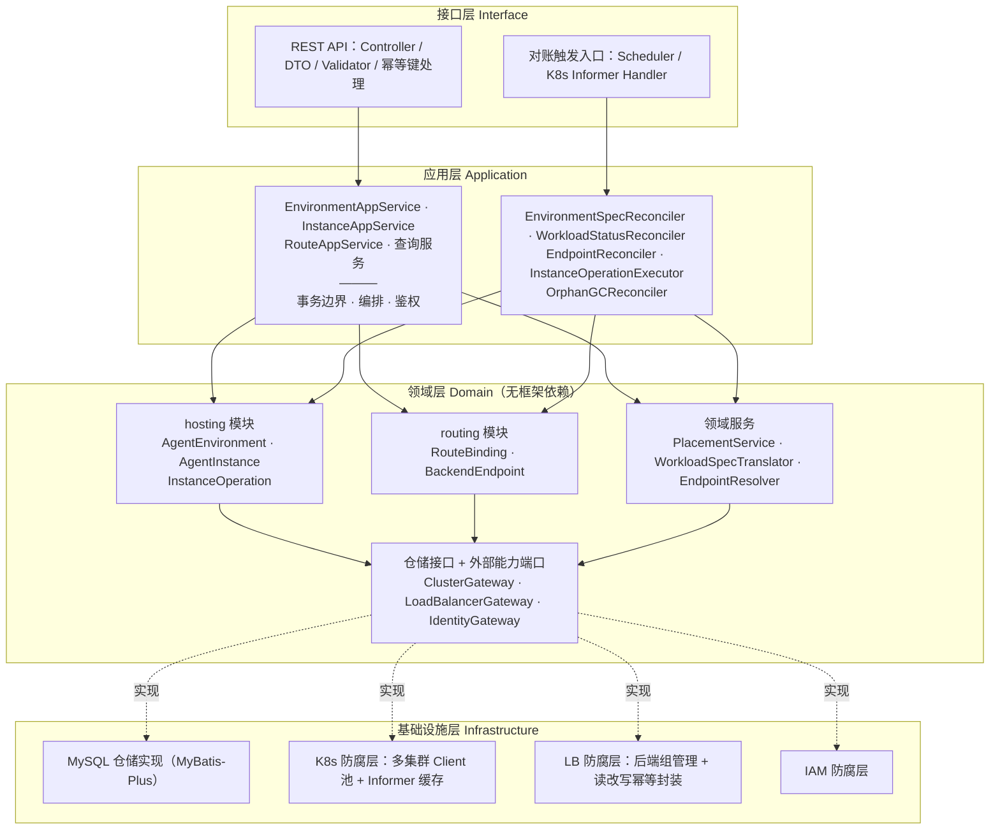
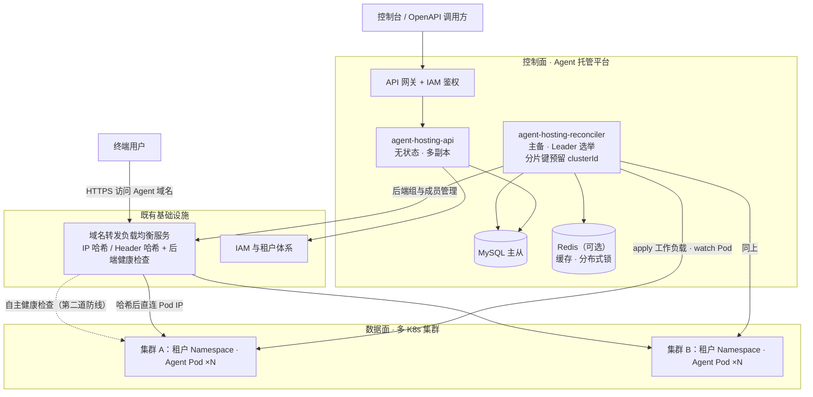
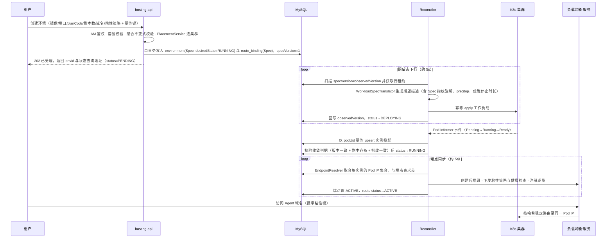
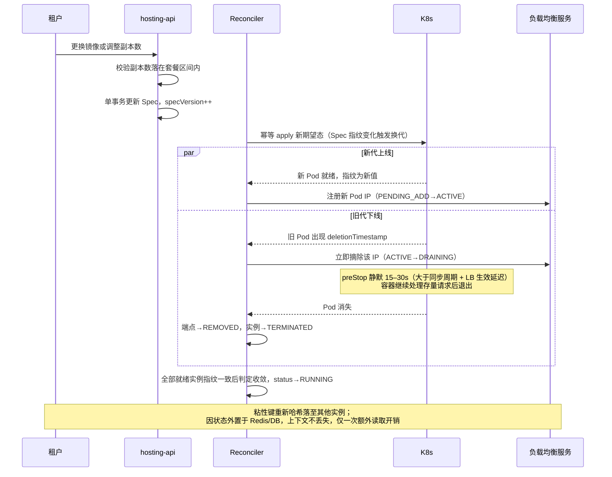

下面是三份重新生成的文档。开头先给出与上一版的差异清单，结尾附上我自己做的逻辑自查记录（包含发现的六处漏洞及其闭合方式），方便你直接对照评审。

**本版相对上一版的实质性修正：**流量路由由核心域降为支撑域，且 MVP 阶段不再作为独立限界上下文而内聚为托管上下文下的 routing 模块；环境引入「期望生命周期 desiredState」与「观测状态 status」分离，消除用户操作与对账循环互相覆盖状态的竞态；明确 `observed_version` 的语义只表示「已下发」，另立收敛判据；实例回归纯投影，用户对实例的操作意图移出实例表；路由状态增加 SUSPENDED，解决「主动停机」与「异常无后端」的语义冲突；删除流程改为状态推导式的拆除顺序，不依赖步骤计数器。

---

# 文档一 ·《Agent 托管运行时平台：平台规划与 MVP 范围定义》

## 1. 定位与边界

平台承接的是 Agent 应用的托管发布。租户交付一个由外部构建服务产出的容器镜像地址，镜像内是一个长驻的 HTTP/WebSocket 服务；平台按平台预置的套餐分配规格与运行约束，在合适的 K8s 集群上把它拉起来并持续维持期望副本数，同时把就绪实例的 Pod IP 注册到既有的域名转发负载均衡服务上，由该服务依据哈希策略实现会话粘性。

这里的"沙箱"是部署单元的规格与策略模板，不是安全隔离边界，安全隔离由既有的多集群与租户体系承担；这里的"会话管理"是路由亲和性，不是会话状态存储。因为 Agent 自身把状态写在 Redis/DB，粘性丢失只造成一次外部存储读取的额外开销，不影响正确性。这个定性直接决定了 MVP 可以省掉会话实体、会话生命周期管理与按会话长度设计的排空窗口这三块最重的东西，也决定了后文所有涉及取舍的地方一律优先保证"不把流量打到已死实例"，而不是优先保证"不打断粘性"。

## 2. 子域划分与投入配比

核心域只有一个：把「套餐 + 镜像 + 期望副本数」持续收敛为「集群中稳定运行的一组 Agent 实例」，即期望态管理与对账收敛。平台的差异化价值全部压在这里——套餐语义如何映射为资源与约束、状态机如何在部分失败下正确推进、账本如何长期不产生孤儿资源，这些无法外购。

| 子域 | 类型 | 判定依据与投入策略 |
|---|---|---|
| Agent 托管（Environment、Instance、对账收敛） | 核心域 | 差异化所在。不变式完整表达、状态机显式建模、幂等与租约、孤儿回收一分不省 |
| 套餐目录 | 支撑域 | 平台特有但逻辑简单，本质是带上下架约束的配置目录 |
| 流量路由（RouteBinding、端点同步） | 支撑域 | 平台特有的集成胶水，价值来自被集成方；允许最直白的实现 |
| 资源池与放置 | 支撑域（二期可能上升） | MVP 退化为集群注册表；若未来装箱、超卖、成本优化成为卖点可升为核心 |
| 负载均衡服务本体、IAM、镜像构建 | 通用域 | 已有现成能力，直接消费，一律经防腐层 |

## 3. 能力全景与阶段划分

| 能力 | MVP | 二期 | 三期 |
|---|---|---|---|
| 套餐目录（只读选用） | 静态预置数据 + 查询接口 | 管理后台 | 租户级可见性策略 |
| 运行环境生命周期 | 完整 | — | 版本与回滚 |
| 运行实例观测与操作 | 列表、详情、重启、驱逐 | 事件与日志聚合 | — |
| 会话粘性路由 | 域名绑定、粘性策略、端点同步 | 健康联动优化 | 多域名、权重、灰度 |
| 资源池 | 集群注册表 + 简单放置 | 容量画像与配额 | 打分器插件、装箱 |
| 弹性伸缩 | 不做，副本数手动 | 并发与 CPU 驱动 | 预测式伸缩、缩容到零 |

## 4. MVP 范围

范围内包括：套餐只读查询；运行环境的创建、配置修改、手动伸缩、启停、删除与查询；实例列表、详情、重启、驱逐；域名绑定、粘性策略配置与解绑；就绪实例端点向外部 LB 的自动同步与排空摘除；环境与实例的健康状态可视；孤儿资源回收；操作审计。

明确不在范围内的包括：源码构建与镜像仓库管理；自动弹性伸缩；缩容到零与冷启动优化；金丝雀与流量权重；跨地域容灾；计费与配额扣减；日志与指标平台自建（仅提供跳转）；租户自定义套餐；显式版本与回滚。

验收口径设定为：用一个镜像地址创建环境并绑定域名，三副本稳定就绪，公网访问可通且粘性键不变时稳定落在同一 Pod；手动改副本数到五，三十秒内 LB 后端出现新增 Pod IP 且存量连接不中断；更换镜像触发滚动更新，全程无 502；停止环境后 LB 后端清空且路由状态为 SUSPENDED 而非告警态；删除环境后 K8s 工作负载、LB 后端组、平台账本三方均无残留；人为制造对账进程宕机十分钟，恢复后系统自行收敛且不产生重复资源。

## 5. 三条决定架构形态的技术路线

**第一，以期望态加对账循环替代领域事件。** 取消领域事件与 CQRS 后，跨聚合与跨系统的一致性责任全部落在写模型上。做法是所有用户操作只在一个 MySQL 事务内修改期望态并递增该聚合的 `spec_version`，后台 Reconciler 持续把期望态推平到 K8s 与 LB，成功后回写 `observed_version` 与观测字段；是否需要动作由两个版本号的比较以及实际态与期望态的差集决定，而非由某条消息触发。这正是 K8s 自身的 generation 与 observedGeneration 机制，天然幂等、可重入、崩溃自愈，且不需要引入消息中间件。代价是所有变更异步生效，API 语义必须是"已受理"而非"已完成"，这一点必须在接口契约中显式声明并提供状态查询手段。

**第二，实例是投影而非权威。** 平台永远不"创造"实例，只观察 Pod 并汇报。用户对实例的操作意图不写入实例投影本身，而是作为独立的操作任务落库，由对账循环消费。这样彻底杜绝了平台账本与集群实际互相打架这一托管平台最常见的烂账来源。

**第三，摘流量必须早于杀进程，且必须有第二道防线。** 采用后端为 Pod IP 的注册方式意味着 Pod 一旦消失其 IP 立即失效，而 LB 侧摘除是异步的，中间窗口会产生 502。第一道防线是对账循环监听 Pod 的 deletionTimestamp，一旦进入 Terminating 立即摘除对应端点；配合容器侧的 preStop 静默等待与足够的 terminationGracePeriod，让容器在收到终止信号后不立刻退出。因为状态外置，静默窗口只需覆盖单次请求的最长处理时间，建议十五到三十秒，且必须大于端点同步周期加 LB 生效延迟之和。第二道防线是在 LB 后端组上配置针对就绪路径的健康检查，当对账进程整体失效时，由 LB 自身的探测把死后端摘掉。两道防线的组合，使得控制面故障不会退化为数据面故障。

## 6. 演进路线与不返工保证

一期六到八周交付上述范围。二期引入伸缩能力时，模型上只是把 `desiredReplicas` 的写入方从"用户 API"换成"伸缩策略计算结果"，环境聚合增加一个 ScalingPolicy 值对象，新增一条采集与调整循环，既有聚合边界不动。三期做流量治理时，把 routing 模块从托管上下文中拆出为独立限界上下文（仍属支撑域），RouteBinding 扩展为支持多后端组与权重；因为它从第一天起就是独立聚合、独立表、独立 ACL 端口，拆分是搬运而非重构。这个顺序保证每一期都不需要推翻前一期的聚合边界。

---

# 文档二 ·《DDD 领域设计》

## 1. 限界上下文与映射关系

上下文映射的三点说明。套餐目录对托管是供应方，但托管在引用时执行快照式拷贝，把规格关键字段固化进环境聚合，从而使套餐后续的下架或新增版本不会污染存量环境。资源池对托管只暴露一个放置决策能力，MVP 退化为一次查询。routing 模块虽然属于支撑域能力，但在 MVP 中与托管共处一个上下文，因为它与环境严格一对一、生命周期完全从属、且端点推导必须直接读取实例就绪态——为它维持跨上下文的翻译层是纯粹成本；但它对外部 LB 的调用仍然必须走 ACL 端口，这条不能省，它隔离的是外部接口变更。

## 2. 聚合设计

### 2.1 SandboxPlan（沙箱策略／套餐）

平台运维维护，租户只读选用。之所以是聚合根而非配置文件，是因为它具有上下架状态与被引用关系这类需要事务保护的不变式。

| 字段 | 类型 | 说明 |
|---|---|---|
| planCode | 标识 | 业务主键，形如 `agent.small.v1`，版本号内嵌 |
| displayName、description | 文本 | 展示用 |
| resourceSpec | 值对象 | cpuMilli、memoryMi、ephemeralStorageMi、gpuType、gpuCount |
| replicaRange | 值对象 | minReplicas、maxReplicas |
| runtimeLimit | 值对象 | maxConcurrencyPerInstance、requestTimeoutSec、gracePeriodSec |
| networkPolicy | 值对象 | egressMode（ALLOW_ALL／WHITELIST／DENY）与白名单 CIDR |
| requiredClusterLabels | 值对象集合 | 放置约束，如 GPU 机型标签 |
| status | 枚举 | DRAFT／PUBLISHED／DEPRECATED |

不变式为：minReplicas 不大于 maxReplicas；DEPRECATED 套餐不可被新环境引用，但存量引用不受影响；PUBLISHED 之后 resourceSpec 与 replicaRange 不可修改，只能发布新的 planCode。最后一条把"改套餐"约束成"发新套餐"，从根上消除了存量环境规格漂移。

### 2.2 AgentEnvironment（Agent 运行环境）— 核心聚合根

它表达"租户希望有这样一个 Agent 服务持续运行着"。字段严格分为三个区，这是本次设计最重要的结构性决定。

**期望区（Spec，仅用户可写，变更递增 specVersion）：**

| 字段 | 类型 | 说明 |
|---|---|---|
| envId、tenantId、envName | 标识 | envName 在租户内唯一，且需满足 DNS-1123 以派生工作负载名 |
| desiredState | 枚举 | RUNNING／STOPPED／DELETED，用户唯一的生命周期意图表达 |
| image | 值对象 ImageRef | registry、repository、tag、digest、pullSecretRef |
| runtimeConfig | 值对象 | command、args、containerPort、protocol |
| envVars | 值对象集合 | 明文键值与 secretRef 引用两类 |
| healthCheck | 值对象 | readinessPath、livenessPath、port、initialDelaySec、periodSec、failureThreshold |
| planCode、planSnapshot | 引用与值对象 | 引用套餐并固化规格快照 |
| desiredReplicas | 整数 | 必须落在 planSnapshot.replicaRange 内 |
| placement | 值对象 | clusterId、namespace、workloadName，创建时一次性确定 |

**观测区（Status，仅对账循环可写，不递增 specVersion，不参与乐观锁）：**

| 字段 | 类型 | 说明 |
|---|---|---|
| status | 枚举 | 见状态机，由对账推导 |
| observedVersion | 长整型 | 已成功下发到集群的 specVersion |
| readyReplicas、totalReplicas | 整数 | 来自 Pod 汇总 |
| workloadObservedGeneration | 长整型 | 集群侧 Deployment 的 observedGeneration |
| lastTransitionAt、message、failureReason | — | 诊断信息 |

**控制区：** optimisticVersion（乐观锁，只保护期望区）、leaseOwner 与 leaseExpireAt（对账租约）、createdAt、updatedAt、deletedAt。

不变式包括：desiredReplicas 必须落在快照的副本区间内，且当 desiredState 为 STOPPED 时不校验下界；引用套餐在创建时必须为 PUBLISHED；image 与 containerPort 必填；desiredState 一旦置为 DELETED 不可逆转，且此后期望区不再接受任何修改。

这里要特别说明为什么把期望生命周期与观测状态拆开。上一版把"用户点停止"和"对账发现全部就绪"写进同一个 status 字段，会产生真实的竞态：用户刚把状态置为 STOPPING，对账循环基于稍早的快照把它覆盖回 RUNNING。拆开之后，两个字段各有唯一写入方，语义正交，竞态从设计上消失，无需任何加锁或条件更新技巧。这也是 K8s 自身 spec 与 status 分离的原因。

### 2.3 AgentInstance（Agent 运行实例）— 独立聚合根，纯投影

之所以不作为环境的内部实体：两百个环境按平均三副本计约六百个 Pod，其 IP、就绪态、重启计数变更频繁，若并入环境聚合，每次心跳都要加载与保存整个聚合并触发乐观锁冲突，吞吐会立刻崩溃。因此按标准做法通过标识跨聚合引用，二者最终一致。

| 字段 | 类型 | 说明 |
|---|---|---|
| instanceId | 标识 | 平台在首次观测到该 Pod 时生成 |
| envId、tenantId | 跨聚合引用 | 仅存标识 |
| workloadRef | 值对象 | clusterId、namespace、podName、podUid |
| podIp、nodeName | 值对象 | podIp 是端点集合的唯一来源 |
| phase | 枚举 | PENDING／STARTING／READY／UNHEALTHY／DRAINING／TERMINATED／FAILED |
| ready | 布尔 | 来自 Pod 就绪条件 |
| configFingerprint | 字符串 | 来自 Pod 注解，标识其对应的 Spec 指纹，用于识别旧代残留 |
| restartCount、startedAt、lastSyncAt | — | 诊断用 |

不变式为：instanceId 与 podUid 严格一一对应，podUid 为幂等键，同名重建会被识别为新实例；只有 phase 为 READY、ready 为真、且未检测到 deletionTimestamp 的实例才有资格成为端点。后一条是会话粘性正确性的基石。

**用户操作意图不写在这张投影上。** 上一版曾把 pendingAction 挂在实例上，这与"纯投影"的定位自相矛盾，且会让 K8s 同步写与用户写落在同一行。本版改为独立的 InstanceOperation 任务记录：operationId、instanceId、envId、type（RESTART／EVICT）、status（PENDING／DRAINING／EXECUTING／SUCCEEDED／FAILED）、attempts、lastError、createdAt。由专门的循环消费，投影表回归单一写入方。

### 2.4 RouteBinding（路由绑定）— 独立聚合根，routing 模块

它封装"一个域名如何按粘性规则把请求分发到一组 Pod IP"。与环境同样采用期望区与观测区分离。

期望区包含 routeId、tenantId、envId、domain（FQDN，全局唯一，平台默认按环境派生子域，允许租户自定义域名并提供 certRef）、listener（protocol、port、certRef）、stickyPolicy（mode 取 SOURCE_IP_HASH 或 HEADER_HASH，headerName，hashAlgorithm，fallbackPolicy）、backendPort、healthCheckSpec（下发给 LB 的探测配置，作为对账失效时的第二道防线），以及 specVersion。观测区包含 status（PENDING／ACTIVE／DEGRADED／SUSPENDED／DELETING）、lbBackendGroupId、observedVersion、lastSyncAt、message。

聚合内实体 BackendEndpoint 包含 endpointId、instanceId、ip、port、weight、state（PENDING_ADD／ACTIVE／DRAINING／PENDING_REMOVE／REMOVED）、lastSyncedAt、lastError。

不变式为：同一 routeId 下 ip 与 port 组合唯一，若发现相同地址对应不同 instanceId，则判定旧记录为陈旧并强制清除后再登记新记录（Pod IP 复用场景必须处理）；端点状态单向流转，进入 DRAINING 后不得回到 ACTIVE，只能走向 REMOVED，以避免摘一半又加回导致的连接抖动；当 ACTIVE 端点数为零时，若所属环境的 desiredState 为 RUNNING 则路由为 DEGRADED，若为 STOPPED 或 DELETED 则为 SUSPENDED。最后这条修正了上一版的语义冲突——主动停机会被误判为异常并持续告警。

关于可用性与正确性的取舍需明确写死：当最后一个 ACTIVE 端点对应的 Pod 进入 Terminating 时，系统仍然执行摘除，宁可让路由短暂进入 DEGRADED，也不把流量继续投向正在消亡的实例。

stickyPolicy 之所以是值对象而非策略实体，是因为它没有独立生命周期，随路由整体替换，比较相等性即可判断是否需要下发。两种哈希模式均由租户在创建时自行选择，平台不做优劣干预。

### 2.5 Cluster（资源池，MVP 极薄）

字段为 clusterId、name、region、kubeconfigSecretRef、status（ACTIVE／CORDONED／OFFLINE）、labels、capacitySnapshot。MVP 只提供领域服务 `PlacementService.select(tenantId, planSnapshot)`，逻辑是先按租户可用集群白名单过滤，再按套餐的 requiredClusterLabels 匹配，最后按剩余容量比率排序取首个。二期替换为打分器插件时接口不变。放置结果在环境创建时一次性写入 placement 并从此不可变，避免"环境漂移到另一个集群"这种在 MVP 阶段代价极高的场景。

## 3. 状态机

必须精确定义两个判据，否则状态机无法落地。

**下发完成**指 `observedVersion == specVersion`，其含义仅仅是"期望态已被成功提交到集群"，不代表业务可用。上一版在这里存在语义含混，本版明确区分。

**收敛完成**是一个更强的复合判据，要求同时满足：observedVersion 等于 specVersion；集群侧 Deployment 的 observedGeneration 已追上其 generation；readyReplicas 等于 desiredReplicas；且该环境下所有 READY 实例的 configFingerprint 均等于当前 Spec 指纹（这一条用于识别滚动更新尚未换代完成的情况）。只有收敛完成才置为 RUNNING。

**失败判据**为：处于 DEPLOYING 且超过 progressDeadline，或存在至少一个 Pod 处于镜像拉取失败、配置引用缺失、崩溃回环状态且就绪副本为零。失败原因需从 Pod 的容器状态中提取并写入 failureReason，这是租户自助排障的唯一入口，不可省略。

实例状态机为：PENDING 到 STARTING 到 READY，READY 与 UNHEALTHY 之间可双向流转，检测到 deletionTimestamp 则进入 DRAINING 并最终 TERMINATED，启动阶段失败则进入 FAILED。端点状态机严格单向：PENDING_ADD 到 ACTIVE 到 DRAINING 到 PENDING_REMOVE 到 REMOVED。

## 4. 无领域事件下的一致性机制

取消领域事件后，全部跨聚合与跨系统协同由五条职责单一的幂等对账循环承担。

**EnvironmentSpecReconciler（期望态下行）**扫描 `specVersion != observedVersion` 或处于中间态的环境，调用 WorkloadSpecTranslator 生成集群侧期望描述并执行幂等 apply，工作负载名由 envId 确定性派生，Spec 指纹写入 Pod 模板注解，因此重复执行完全无副作用；成功后回写 observedVersion。当 desiredState 为 STOPPED 时，本循环的动作是把副本数下发为零而非删除工作负载，从而保留配置以便快速重启。

**WorkloadStatusReconciler（观测态上行）**由 Deployment 与 Pod 的 Informer 事件驱动，以 podUid 为幂等键 upsert 实例投影，汇总就绪副本数，按上节判据推进环境 status。它只写观测区，不触碰期望区，因此与用户操作永不冲突。

**EndpointReconciler（端点同步）**是会话粘性的执行者。按 envId 查询合格实例集合，与端点表求差集：新增者置 PENDING_ADD 并向 LB 注册，消失或进入 Terminating 者置 DRAINING 并向 LB 摘除，确认后落 REMOVED。对 LB 的调用优先使用"全量设置后端组成员"这类幂等语义；若外部接口仅提供增量操作，则由 ACL 内部先读取现状再计算差异，把幂等性做在适配器里而不是领域层。粘性策略与健康检查配置的变更由该路由的 specVersion 比较驱动，与端点同步共用一次循环但互不阻塞。

**InstanceOperationExecutor（实例操作执行）**消费 InstanceOperation 任务：对 EVICT 与 RESTART，先把对应端点置为 DRAINING 并确认 LB 已摘除，等待静默期后再删除 Pod，随后由 Deployment 自行补齐副本。任务以 operationId 幂等，超时重试不会重复删除，因为删除前会先校验 podUid 是否仍然存在。

**OrphanGCReconciler（反向清理）**以十分钟级低频做全量比对，处理三类脏数据：账本有记录而集群已不存在的实例，集群存在而账本无对应环境的工作负载（按平台专属标签识别，避免误删他人资源），LB 后端组中存在而账本无对应端点的地址。这条是长期运行不产生烂账的兜底，也是控制面数据库回滚或恢复后的自愈手段。

保障这套机制成立的四条工程纪律：同一聚合同一时刻只允许一个 worker 处理，通过表内租约字段实现；所有外部调用必须可重复执行；失败采用指数退避重新入队而非丢弃，并记录 lastError 供排障；期望区写入与 specVersion 递增必须在同一事务内完成。在两百环境量级下，做到这四条，事件驱动的边际收益基本被覆盖，而系统复杂度显著更低。

**删除流程不使用步骤计数器，而采用状态推导式拆除。** 每轮对账重新检查四个事实：LB 后端组是否仍存在成员、后端组本身是否仍存在、工作负载是否仍存在、Pod 是否仍存在；按此顺序推进，任一步骤失败则本轮退出并等待下轮。全部为假时才软删除账本行。这样中途崩溃无需恢复任何进度信息，天然可重入。

## 5. 应用服务与领域服务

应用服务是事务边界所在，每个方法一个事务：EnvironmentAppService 提供创建、更新配置、调整副本、启动、停止、删除、查询；InstanceAppService 提供列表、详情、提交重启与驱逐任务；RouteAppService 提供绑定域名、更新粘性策略、解绑、查询端点；PlanQueryService 与 ClusterQueryService 只读。创建类接口必须接受客户端幂等键，以防网络重试产生重复环境。

领域服务均为无状态：PlacementService 负责集群选择；WorkloadSpecTranslator 负责把环境聚合翻译为集群侧期望描述——它属于领域服务而非基础设施，因为翻译规则承载业务语义，例如套餐的出网策略如何映射为网络策略、运行约束如何映射为优雅停止时长；EndpointResolver 负责从实例集合推导合法端点集，并执行"只有就绪实例可接流"这条不变式。

## 6. 数据模型要点

核心表为 sandbox_plan、agent_environment、agent_instance、instance_operation、route_binding、backend_endpoint、cluster、operation_log 共八张。值对象一律以 JSON 列内联存储而不单独建表——值对象无标识、无独立查询需求，拆表只增加映射复杂度。

关键索引与约束为：agent_environment 建 (tenant_id, env_name) 唯一索引，并建 (status, spec_version, observed_version) 组合索引供对账扫描，另建 (lease_expire_at) 支持租约回收；agent_instance 以 pod_uid 建唯一索引，这是同步幂等的关键；backend_endpoint 建 (route_id, ip, port) 唯一索引；route_binding 的 domain 建全局唯一索引；instance_operation 建 (status, created_at) 供任务扫描。所有聚合根表统一携带乐观锁版本、时间戳、租约字段与软删除标记。

需要显式承认的一致性边界：环境与路由分属两个聚合，创建时虽在同一事务落库，但对集群与 LB 的下发是两次独立的异步动作，因此存在"工作负载已就绪而域名尚未生效"的中间窗口，这在托管平台是可接受且必须向用户明示的语义，通过状态查询接口暴露而不是试图用分布式事务消除。

---

# 文档三 ·《系统架构设计》

## 1. 分层架构与模块划分

依赖方向严格向内，领域层不出现任何 Fabric8 或 Spring 类型。对账循环归属应用层而非基础设施层，因为它承载的是编排语义——何时推进状态机、何时摘除端点——只是触发源为定时器与 Informer 而非 HTTP 请求。routing 作为领域层内的独立模块存在，与 hosting 之间仅通过 envId 与 EndpointResolver 交互，为三期拆分为独立上下文预留了干净的切口。

## 2. 部署拓扑

控制面与数据面完全分离是本架构的基本要求：控制面整体宕机时，已注册在 LB 上的实例仍正常服务，只是无法变更与自愈；配合 LB 自身的后端健康检查，即使对账长时间失效，死后端也会被摘除。API 与 Reconciler 分进程部署，避免长循环影响接口响应。两百环境、约六百 Pod 的规模下，单个 Reconciler 实例的 Informer 内存占用在百兆量级，主备部署即可，分片键预留 clusterId 以便未来横向扩展而不改代码结构。

## 3. 关键流程

### 3.1 创建并发布运行环境

### 3.2 滚动更新与扩缩容中的端点同步

### 3.3 停止与删除

停止时用户只修改 desiredState 为 STOPPED，对账循环先把端点全部摘除并将路由置为 SUSPENDED，再把工作负载副本下发为零，待 Pod 全部消失后环境置为 STOPPED；工作负载本体与路由配置保留，重新启动只需把 desiredState 改回 RUNNING。删除时 desiredState 置为 DELETED 且期望区就此冻结，对账按状态推导式顺序依次拆除 LB 成员、LB 后端组、工作负载、残留 Pod，四项事实全部为假后软删除账本，最后由孤儿回收循环做最终校验。

### 3.4 请求侧粘性路径

终端请求打到域名后，外部 LB 依据路由中配置的粘性模式计算键值——源 IP 模式取客户端地址，请求头模式取指定头——映射到后端组内某个 Pod IP 并直连。控制面完全不参与转发，既不构成性能瓶颈也不构成故障点。当后端成员集合变化时，普通取模哈希会引发大面积重映射，因此 hashAlgorithm 作为可配置字段透传给 LB，由租户按其 LB 支持的算法自行选择。

## 4. 技术选型与非功能约束

后端采用 Java 17 与 Spring Boot 3，持久化选 MyBatis-Plus（相比 JPA 更适配 JSON 列与手写对账扫描 SQL），集群交互使用 Fabric8 Kubernetes Client 并为每个集群维护独立 Client 与 Informer，Leader 选举与分布式锁可用 Redis，若不愿引入则完全可以用 MySQL 行租约替代。工程结构按限界上下文分模块，模块内再分四层，模块间只允许通过应用层接口调用，禁止跨模块直接访问仓储。

循环周期建议：期望态下行五秒，观测态由 Informer 事件驱动并辅以一分钟全量兜底扫描（防止 Informer 静默丢事件），端点同步五秒，实例操作五秒，孤儿回收十分钟。

可观测性方面，必须为每个聚合的对账过程打点，其中「specVersion 与 observedVersion 的滞后时长 P99」「处于中间态超过阈值的环境数量」「端点同步失败率」「LB 调用错误率」四项是这套无事件架构的核心健康指标，必须配置告警。缺少前两项，异步收敛失败将完全不可见，这是该架构模式最大的运维风险点。

安全方面，kubeconfig 与镜像拉取凭证一律存放于外部密钥服务并只保存引用，平台库内不落明文；平台创建的所有集群资源必须打上统一的归属标签，孤儿回收仅在带标签的资源范围内执行删除，防止误伤。

---

## 附：逻辑自查记录

我对上一版做了一遍闭环检查，发现并修正了六处漏洞，列出以便你复核我的判断是否成立。

第一处是**状态字段的双写竞态**。原设计中 status 同时被用户操作与对账循环写入，用户置为 STOPPING 后可能被对账基于旧快照覆盖回 RUNNING。修正方式是拆分 desiredState 与 status，使每个字段只有唯一写入方。

第二处是**收敛语义含混**。原设计以 observedVersion 追平 specVersion 作为完成标志，但这只代表下发成功，滚动更新期间新旧 Pod 并存时会被误判为 RUNNING。修正方式是定义包含指纹一致性在内的复合收敛判据。

第三处是**实例投影被写入用户意图**。原设计把 pendingAction 挂在实例上，破坏了纯投影定位并造成双写。修正方式是抽出独立的 InstanceOperation 任务记录。

第四处是**路由状态语义冲突**。原不变式规定 ACTIVE 端点为零即 DEGRADED，导致主动停机被误报为异常。修正方式是引入 SUSPENDED 并由所属环境的 desiredState 区分两种情形。

第五处是**Pod IP 复用未处理**。端点表以地址与端口唯一，新 Pod 复用旧 IP 而旧记录尚未清除时会插入冲突。修正方式是增加陈旧记录识别与强制清除规则。

第六处是**控制面失效等于数据面失效**。原设计中死后端的摘除完全依赖对账循环，对账进程一旦长时间不可用，故障实例将持续接收流量。修正方式是在后端组上同时下发 LB 自身的健康检查作为第二道防线。

另外有两处是刻意保留的、无法通过设计消除的取舍，需要你确认可接受：一是环境与路由的下发是两次独立异步动作，存在"实例已就绪而域名尚未生效"的中间窗口，本设计选择向用户明示而非用分布式事务消除；二是当最后一个就绪实例进入终止态时系统仍执行摘除，路由会短暂进入 DEGRADED，即优先保证不向消亡实例投递流量而非优先保证可用性。

下一步的阻塞项是 REST API 契约（资源路径、字段、异步语义与状态查询方式）与 MySQL 建表清单，你想先要哪一份？