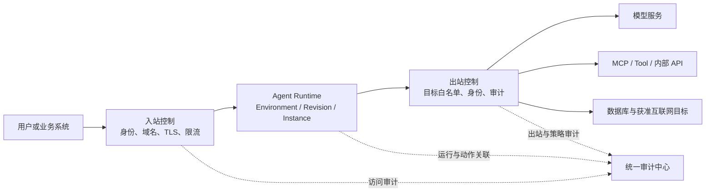

# Agent PaaS 治理与安全范围讨论稿

> 状态：业务讨论稿，尚未形成最终 DDD 与技术方案
>
> 日期：2026-07-29
>
> 已确认的立项主叙事：建设长期统一的企业 Agent 基础设施

## 1. 结论

审计日志、Agent 入站/出站流量控制和安全护栏都合理，而且与“企业统一 Agent 基础设施”的定位高度一致。它们不是三个互不相关的附加功能，而是同一条治理链路：

1. 流量控制决定请求和调用能否到达目标；
2. 安全护栏决定某项内容或动作是否允许执行；
3. 审计记录谁在什么上下文中做了什么、平台如何决策、最后结果是什么。

但三者的产品责任不同：

| 能力 | Agent PaaS 的责任 | 需要复用或集成 | 是否要求 Agent 配合 |
|---|---|---|---|
| 控制面审计 | 原生负责 | 企业 IAM、日志/SIEM | 否 |
| 平台执行审计 | 原生负责 | Kubernetes、LB、MQ 等执行结果 | 否 |
| 入站流量控制 | 编排并呈现统一策略 | 既有 LB、域名、证书、认证和限流能力 | 通常否 |
| 出站流量控制 | 绑定策略、阻止绕过、展示命中结果 | Egress Gateway、防火墙、Service Mesh 或网络平台 | 通常否 |
| Runtime 安全基线 | 强制容器、身份、网络与节点约束 | Kubernetes、专属节点或未来的长期服务强化 Runtime | 否 |
| 安全任务执行 | 绑定 SecureTaskProfile，关联任务状态和审计 | 企业已有的数小时短期安全沙箱 | 是，需要 Agent 通过平台 Tool / Task 接口委托执行 |
| 提示词与内容护栏 | 提供绑定、执行状态和审计入口 | 模型网关或 AI 安全网关 | 取决于流量是否经过受控网关 |
| 高危工具操作护栏 | 提供策略绑定、审批和审计体验 | MCP / Tool Gateway、策略引擎、审批系统 | 是，需要标准化工具调用上下文 |

因此，产品宜定位为“统一托管与治理入口”，而不是在 MVP 中自研所有网络与 AI 安全检测引擎。

## 2. “Agent 的任何操作都可审计”应该怎样定义

建议把立项语言写成：

> 平台保证所有外部可观察、对业务或安全产生影响的 Agent 操作可追踪、可关联、可审计。

不建议承诺记录 Agent 的“所有内部过程”。任意 OCI 镜像内部可能存在平台不可见的代码路径；模型思维链也不应被当成审计对象。完整记录 Prompt、响应正文和工具参数还会引入隐私、敏感数据、存储成本和访问权限问题。

### 2.1 五层审计覆盖

| 层级 | 典型事件 | 获取方式 | 建议阶段 |
|---|---|---|---|
| 控制面操作 | 创建环境、修改配置、部署、回滚、扩缩容、停止、删除、绑定域名、变更策略 | Agent PaaS 原生记录 | MVP 必须 |
| 平台自动执行 | 调度、Kubernetes 资源变更、LB 后端变更、自动恢复、周期对账、漂移修复 | 平台执行器和适配器记录 | MVP 必须 |
| 数据面访问 | 谁调用了哪个 Endpoint、路由到哪个 Revision/实例、结果码、耗时、会话键哈希 | LB / Gateway 访问日志并用 Request ID 关联 | MVP 基线，持续增强 |
| Agent 外部动作 | 调用哪个模型、工具、MCP、数据库或外部 API，策略如何判定 | 模型/工具/Egress Gateway 或 Agent SDK | 第一阶段增强 |
| 内容与安全决策 | 提示词攻击、敏感信息、高危操作、放行/观察/阻断/审批结果 | AI 安全网关和策略引擎 | 第一阶段增强 |

### 2.2 一条审计记录至少回答

- 谁：用户、服务账号、Agent 工作负载身份或平台系统；
- 在哪里：租户、项目、运行环境、Revision、实例；
- 做什么：动作类型、目标资源和风险等级；
- 为什么允许：命中的权限、网络或护栏策略及版本；
- 结果如何：成功、失败、拒绝、超时或待审批；
- 前后变化：控制面变更的字段差异；
- 如何串联：Request ID、Trace ID、Operation ID 和上游审计 ID；
- 何时何地：时间、来源地址、入口和目标；
- 如何保护：敏感字段脱敏、正文采集策略和保留期限。

### 2.3 审计日志不等于运行日志

| 类型 | 目的 | 默认保留内容 |
|---|---|---|
| 操作审计 | 追责和变更还原 | 身份、动作、资源、前后差异、结果 |
| 访问审计 | 还原调用和路由链路 | 请求元数据、Revision、实例、状态、耗时 |
| 安全事件 | 解释策略命中和处置 | 风险类型、策略版本、判定、处置、审批 |
| 应用运行日志 | 排查 Agent 代码问题 | 由 Agent 输出，可能包含业务内容 |

审计记录应追加写入、禁止普通用户修改，并支持导出到企业日志/SIEM。Prompt 和响应正文默认不进入通用审计；如业务确需采集，应按环境启用、脱敏、单独授权和设定保留期限。

## 3. Agent 入站与出站流量控制

### 3.1 需要同时管理两条方向



如果只控制入站，Agent 仍可能直接访问未批准的模型、工具、数据库或互联网地址；如果只建设安全护栏但允许绕过受控网关，护栏也无法提供确定性保证。因此，出站策略与“禁止绕过治理网关”是高危操作治理能够成立的前提。

### 3.2 入站策略应表达业务意图

MVP 不需要重造已有 LB。Agent PaaS 只需让用户选择管理员预置的 Ingress Profile，并展示实际生效状态：

- 内网、企业网或获批公网可见性；
- 调用方身份与认证方式；
- 域名和证书引用；
- HTTP/HTTPS、SSE、超时和请求体上限；
- QPS、并发、连接数和异常流量限制；
- 会话 Header 与尽力亲和；
- 来源网段或调用方白名单；
- 访问日志和 Request ID。

### 3.3 出站策略比普通 Web 应用更重要

Agent 会主动调用模型、工具和数据，出站能力直接决定其实际权限。建议由管理员维护少量 Egress Profile，普通用户只做选择：

- `restricted-internal`：仅访问已批准的企业内网服务；
- `approved-model-and-tools`：仅访问企业模型网关、MCP / Tool Gateway 和指定数据服务；
- `reviewed-internet`：允许经代理访问审核后的公网目标；
- `isolated`：除平台必需依赖外不允许出站。

Profile 可包含目标域名/CIDR、端口、协议、工作负载身份、DNS、代理、日志和例外审批。Agent PaaS 保存 Profile 引用和生效状态；具体网络规则继续由既有网络平台执行。

仅有 Kubernetes NetworkPolicy 通常只能解决网络层允许或拒绝，不能理解“退款金额”“调用哪个 Tool”或“Prompt 是否为注入攻击”。这些语义需要模型、MCP 或 Tool Gateway。

## 4. 安全护栏应拆成三层

### 4.1 工作负载安全基线

这是 Hosting 平台原生应承担的能力，与模型内容无关：

- 只部署经准入的镜像和固定 Digest；
- 镜像漏洞、签名与来源校验；
- 非 root、禁止 privileged/hostPath/hostNetwork；
- Secret 引用和工作负载身份，不允许粘贴长期 AK/SK；
- 每环境独立身份，禁止跨环境共享长期模型 API Key；
- 高风险任务必须委托给企业安全沙箱，不能在 Agent 主容器中静默执行；
- 高风险长期 Environment 可选择专属节点；
- CPU、内存、临时磁盘和进程约束；
- 入站/出站 Profile 强制绑定；
- 环境、Revision、实例和策略变更全量审计。

这部分可以并且应该成为 MVP 安全基线。

### 4.2 Prompt、输入输出与敏感数据护栏

可检测提示词注入、越狱、系统提示泄露、敏感信息、违规内容和算力消耗攻击，并执行观察、阻断、脱敏或安全代答。

但 Hosting 平台只有在以下条件满足时才能可靠执行：

- 请求以平台可理解的明文协议经过受控 Gateway；
- Gateway 知道请求/响应的字段结构；
- SSE 等流式响应有明确支持边界；
- 加密业务载荷、私有协议或 Agent 内部再次调用模型时不会绕过检测。

因此建议 Agent PaaS 提供 Guardrail Profile 的选择、生效状态、命中概览和日志跳转，检测引擎由现有或独立 AI 安全网关提供。

### 4.3 高危工具与业务操作护栏

“Prompt 看起来安全”不代表“动作可以执行”。真正高风险的是 Agent 以某个身份调用工具后产生业务副作用，例如：

- 转账、退款、下单和改价；
- 删除数据、修改权限或停用账号；
- 执行 Shell、下载并运行文件；
- 向外部地址发送敏感数据；
- 在生产系统创建、更新或删除资源。

高危操作应在 Agent 代码之外的 Tool / MCP Gateway 进行确定性校验，至少使用：

- 调用方和最终用户身份；
- Agent、环境与 Revision；
- Tool 名称和结构化参数；
- 目标资源、金额、数据级别和时间窗口；
- 允许、拒绝、只观察或需要人工确认；
- 策略版本与完整决策日志。

提示词攻击检测是概率性风险识别；高危动作授权必须是确定性的“默认拒绝、显式允许”。二者不能互相替代。

## 5. 建议的产品分期

### MVP：可托管、可约束、可追责

- 控制面和平台自动执行的审计覆盖；
- Request / Operation / Trace ID 贯穿发布、路由和实例；
- 复用既有 LB 的 Ingress Profile；
- 复用网络平台的 Egress Profile，并显示实际生效状态；
- 强制工作负载安全基线；
- 通过 `SecureTaskProfile` 绑定现有短期安全沙箱，用于 Shell、浏览器、代码和文件处理等高风险任务；不把它作为 Agent Runtime；
- 禁止共享长期模型 API Key，优先让模型网关代持供应商凭证；
- 访问日志只记录必要元数据，会话键默认哈希；
- 为未来 Guardrail Profile、策略决策和工具调用审计预留标准关联字段；
- 如果企业已有 AI 安全网关，可做一个“观察模式”的试点集成，但不让它阻塞首个 Hosting 闭环。

### 第一阶段增强：可识别、可阻断

- 绑定模型/AI 安全网关的 Guardrail Profile；
- 输入、输出、敏感数据和提示词攻击检测；
- MCP / Tool Gateway 接入和工具级策略；
- 高危动作二次确认或审批；
- 安全事件中心、告警和 SIEM 联动；
- 禁止 Agent 绕过已绑定的模型/工具治理入口。

### 后续阶段：持续治理

- 跨多步工具调用的风险关联；
- 基于用户、Agent、工具参数和业务上下文的细粒度策略；
- 策略仿真、灰度观察、误报回放和效果评估；
- Agent 上线前红队测试与持续安全评测；
- 企业级数据分级、长期归档和合规报告。

## 6. 对页面和业务旅程的影响

### 6.1 创建运行环境

普通用户不应面对几十条网络与安全规则。创建页只新增三个受管配置：

1. Ingress Profile：谁可以调用；
2. Egress Profile：Agent 可以访问哪里；
3. Security Baseline：平台强制且通常不可关闭。

需要高风险工具的 Agent 可在高级配置中选择 `SecureTaskProfile`；页面必须说明它只保护被委托的短期任务，不保护长期 Agent 主进程。Guardrail Profile 在具备统一协议或安全网关后再显示；初期可放在部署后的“安全与治理”页中做增强绑定。

### 6.2 环境详情

建议新增“安全与治理”页签，首屏回答：

- 当前入站、出站和安全基线是否生效；
- 是否存在未受控或可绕过的路径；
- 最近是否有拒绝、攻击或高危动作；
- 当前策略版本是什么；
- 如何查看关联的访问、动作和安全审计。

### 6.3 管理员页面

```text
平台治理
  ├─ 审计中心
  ├─ 安全事件
  ├─ Ingress Profile
  ├─ Egress Profile
  ├─ Guardrail Profile
  ├─ 高危操作审批（增强阶段）
  └─ 策略覆盖与例外
```

## 7. 建议验收指标

| 目标 | 指标 |
|---|---|
| 可追责 | 控制面操作审计覆盖率；平台自动变更关联率；审计查询成功率 |
| 可约束 | 绑定 Ingress/Egress Profile 的环境占比；策略实际生效率；未授权出站阻断数 |
| 可关联 | 从入口 Request ID 关联到 Revision、实例、出站调用和安全决策的成功率 |
| 可保护 | 安全基线覆盖率；明文长期凭证数量；高危镜像准入失败数 |
| 可治理 | 护栏策略覆盖率；安全事件闭环时间；高危动作审批与拒绝数量 |
| 不扰民 | 策略误报率；发布额外耗时；安全网关增加的延迟 |

## 8. 主流产品给出的边界证据

- AWS 把 Runtime、Gateway、Policy 和 Guardrails 分开：Runtime 负责托管，Gateway 成为受控入口，Policy 在 Agent 代码之外拦截工具动作并记录每次策略决策。[AgentCore Policy](https://docs.aws.amazon.com/bedrock-agentcore/latest/devguide/policy.html)
- AWS 明确要求通过 Gateway 防止绕过，并指出 HTTP Runtime 若要使用 Guardrails，需要提供结构化 Schema；这说明 Hosting 无法自动理解任意容器的业务语义。[Runtime 作为 Gateway Target](https://docs.aws.amazon.com/bedrock-agentcore/latest/devguide/gateway-target-http-runtime.html)
- AWS 的 Runtime 安全最佳实践分别讨论入站/出站网络、CloudTrail 控制面与调用审计、请求 ID 关联和 VPC Flow Logs，也明确把输入校验与提示词注入防护列为共享责任。[Runtime 安全最佳实践](https://docs.aws.amazon.com/bedrock-agentcore/latest/devguide/runtime-security-best-practices.html)
- 腾讯云把 AI Agent 安全网关作为独立产品，提供 MCP 路由、正反向代理、流量控制、提示词/敏感内容规则和安全日志；其旅程是先接入模型或 MCP，再绑定规则和应用。[腾讯云 AI Agent 安全网关](https://cloud.tencent.com/document/product/1627/78608)、[快速入门](https://cloud.tencent.com/document/product/1627/78612)
- 火山 AgentKit 在运行时详情中提供安全围栏和攻击日志，但官方旅程仍要求“在 Agent 中集成安全围栏”；攻击日志覆盖提示词攻击、敏感数据、模型滥用和算力消耗等风险。[在 Agent 中集成安全围栏](https://www.volcengine.com/docs/86681/2178840)、[查看攻击日志](https://www.volcengine.com/docs/86681/2178843)
- 阿里 AgentRun 原生提供基础入站凭证、VPC 和公网开关；消费者授权与限流在 AI 网关，内容护栏也通过 AI 网关关联独立安全产品。MCP Tool Hook 允许在调用前后接入客户判定服务，但不能覆盖绕过 MCP 代理的容器内部调用。[AgentRun 高代码创建](https://help.aliyun.com/zh/functioncompute/create-agent-by-code-high-code)、[Agent API 策略与插件](https://help.aliyun.com/zh/api-gateway/ai-gateway/user-guide/configure-policies-and-plug-ins)、[AI 安全防护](https://help.aliyun.com/zh/api-gateway/ai-gateway/user-guide/content-security-protection/)、[MCP Tool Hook](https://help.aliyun.com/zh/functioncompute/mcp-tool-hook)

这些产品共同证明：审计和网络约束属于生产托管的基础面；内容与工具语义护栏应通过 Gateway、标准协议或 Agent 集成完成。
