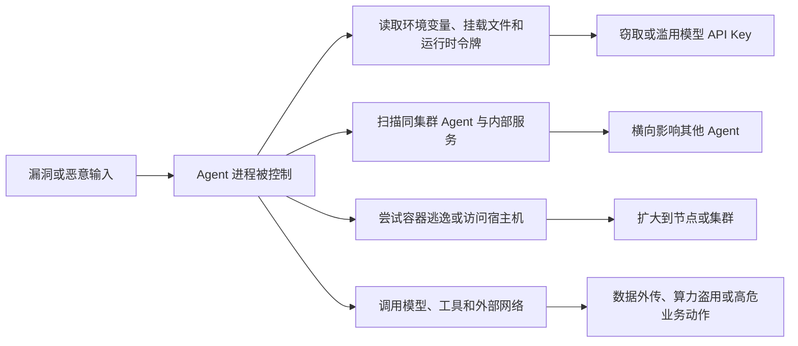
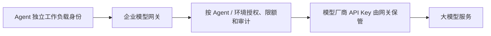
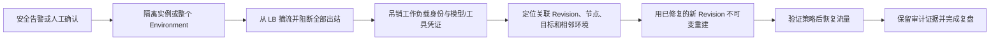

# Agent PaaS 首要安全事故与爆炸半径模型

> 状态：业务与产品讨论稿，尚未形成最终技术设计
>
> 日期：2026-07-29
>
> 首要事故场景：某个 Agent 因应用、依赖、镜像或工具漏洞被完全攻破，攻击者尝试横向影响其他 Agent，或窃取并滥用大模型 API Key。

## 1. 风险判断

这个场景应成为 Agent PaaS 的首要安全设计场景。它比“某次 Prompt 输出不合规”更接近平台级事故，因为可能同时造成：

- 同租户其他 Agent 被横向控制；
- 集群节点、Kubernetes API 或平台控制面被访问；
- 共享的大模型 API Key、工具凭证和数据凭证被窃取；
- 模型额度被盗用，敏感数据被外传；
- 攻击者借 Agent 的合法身份继续调用企业系统；
- 事后无法确定受影响范围和需要轮换的凭证。

设计时不应假设 Agent 镜像可信，也不应把“容器正在运行”当成安全边界。建议使用更强的威胁假设：

> 任意一个 Agent 实例都可能被完全控制；平台必须阻止它跨越所属环境的网络、身份、凭证、宿主机和控制面边界。

## 2. 典型攻击路径

入口不一定是 Prompt 注入，也可能是：

- Agent HTTP 接口或依赖库的远程代码执行漏洞；
- 恶意或被投毒的 OCI 镜像、基础镜像和依赖；
- Agent 调用存在命令注入的 Tool；
- Prompt 注入诱导 Agent 调用具备 Shell、文件或网络能力的高权限工具；
- 凭证、环境变量或日志意外泄露；
- Kubernetes、容器运行时或内核漏洞。

Prompt 护栏只能降低其中一部分入口风险，不能代替运行环境隔离和凭证治理。

## 3. 六条可验收的安全不变量

| 编号 | 安全不变量 | 验收含义 |
|---|---|---|
| S1 | 一个失陷 Agent 不能直接访问其他 Agent 的实例端口 | Agent 间默认网络拒绝，只允许经过明确治理的服务入口 |
| S2 | 一个环境不能读取另一个环境的 Secret 或身份 | 每个环境独立 Namespace、Service Account、Secret 和授权边界 |
| S3 | Agent 工作负载不能访问 Kubernetes API、节点元数据和平台控制面 | 默认不挂载 K8s API Token，控制面与工作负载网络分离 |
| S4 | Agent 内不出现跨环境共享的长期模型 API Key | 优先由模型网关代持凭证；降级方案也必须每环境独立、可限额、可快速吊销 |
| S5 | Agent 只能访问获准的模型、工具、数据和网络目标 | Egress 默认拒绝，按 Security / Egress Profile 显式放行 |
| S6 | 单实例可以被独立隔离、吊销身份和替换，并能还原影响范围 | 一键隔离、凭证吊销、不可变重建和关联审计形成闭环 |

安全验收不应只测试“正常部署成功”，还要主动验证这些负向约束。

## 4. 内部安全沙箱的正确定位

已确认企业安全沙箱支持最长数小时的短期任务，不适合承载持续运行、需要稳定 Endpoint 和 LB 会话亲和的 Agent Runtime。因此产品边界调整为：

- 长期 Agent 主进程继续运行在 Kubernetes Agent Runtime 中；
- Shell、浏览器、代码执行、文件处理等高风险任务由 Agent 提交给安全沙箱；
- 安全沙箱是受管的短期任务执行服务，不是 Agent 运行实例的另一种调度后端。

为了避免与原先表示部署套餐的“沙箱策略”混淆，产品语言建议区分：

- `RuntimePlan`：Agent 主进程的 CPU、内存、临时磁盘、副本和运行限制；
- `RuntimeSecurityBaseline`：长期 Runtime 强制执行的容器、身份和网络安全基线；
- `SecureTaskProfile`：短期安全任务允许的资源、时长、网络、文件和工具范围。

### 4.1 安全沙箱能够显著降低

- 高风险代码或命令直接在长期 Agent 主进程中执行的风险；
- 一次 Tool 任务访问宿主机、共享文件系统和其他任务的风险；
- 恶意系统调用、任务资源耗尽和任务级网络外联风险；
- 任务执行结果和临时文件长期残留的风险；
- Shell、浏览器和代码工具漏洞扩大到 Agent Runtime 的概率。

具体强度取决于安全沙箱的实例隔离粒度、网络、文件系统、身份和任务销毁机制。

### 4.2 安全沙箱不能单独解决

- 长期 Agent HTTP 服务、依赖库或容器运行时自身被攻破；
- 被攻破的 Agent 主进程读取已经注入给自己的模型 API Key；
- Agent 使用本来就有权使用的身份调用模型、工具或沙箱任务；
- Agent 通过长期 Runtime 已获准的出站网络外传数据；
- 未经过平台 Tool / MCP 接口、仍在 Agent 容器内部执行的命令；
- 多个 Agent 共享同一长期凭证造成的跨环境爆炸半径。

安全沙箱只能约束真正委托给它的任务。任意 OCI Agent 若继续在自身容器内运行 Shell 或高危工具，平台不能宣称这些动作已获得沙箱保护。

### 4.3 Agent 部署联动旅程

1. 管理员预置 `SecureTaskProfile`，定义允许的任务类型、最长时长、资源、网络、文件、身份和审计策略。
2. Agent Environment 在部署时选择或由策略绑定 Profile；高风险工具只能指向受管安全沙箱。
3. 平台验证 Agent 身份有权提交该 Profile 的任务，并限制 Agent 只能访问安全沙箱服务入口。
4. Agent 发起任务时携带 Environment、Revision、最终用户和 Request ID，沙箱返回独立 Task ID。
5. 任务运行数分钟至数小时，完成、失败、取消或超时后销毁执行环境和临时凭证。
6. Agent Runtime、Tool 调用、安全任务和审计记录通过 Request ID / Task ID 关联。

如果 Agent 声明某项能力必须使用安全任务，而 Profile 无效或沙箱不可用，该能力应失败关闭，不能静默回退到 Agent 主容器执行。

### 4.4 仍需核验的集成契约

- Agent 通过什么标准接口提交、取消和查询任务；
- 是否支持同步、异步和流式任务结果；
- 单任务最长时长、并发、排队、超时和取消语义；
- 输入文件、输出产物和临时存储如何交付与销毁；
- 每个任务的身份、网络白名单和 Secret 使用边界；
- 安全日志、Task ID、Request ID 和 Agent 审计如何关联；
- 沙箱不可用时是否存在旁路或本地执行回退。

## 5. 模型 API Key 的产品策略

### 推荐路径：模型网关代持

Agent 只持有短期、面向企业模型网关且绑定自身环境的身份，不接触模型厂商长期 API Key。即使实例被攻破，攻击者仍只能在该 Agent 的模型、额度、时间和网络范围内滥用，平台可以立即吊销。

模型网关至少应按租户、项目、环境和 Revision 记录：

- 可调用模型；
- QPS、Token、并发和费用额度；
- 允许的来源身份和网络；
- 调用审计和异常告警；
- 身份吊销和密钥轮换影响范围。

模型网关会因此成为 Tier-0 安全资产：供应商 Key 应按生产/测试、租户或风险域分区，不能把全企业共享 Key 集中成一个新的单点爆炸半径；查看、导出、轮换凭证和修改鉴权策略必须最小权限并完整审计。

### 暂时无法使用模型网关时

最低要求是每个 Agent 环境使用独立的 Secret 引用，禁止多个环境共享一个长期 Key，并配套：

- 独立额度和调用范围；
- 定期轮换和立即吊销；
- 不进入镜像、普通环境变量展示、日志或审计正文；
- 事件发生后可以准确列出需要轮换的凭证。

这只能缩小损失，不能阻止被攻破进程读取其自身有权读取的 Key。

## 6. 纵深防御产品能力

### 6.1 运行与宿主隔离

- 以强制拒绝模式使用 Kubernetes Restricted 安全基线，不能只告警而继续部署；
- 非 root、禁止提权、丢弃 Linux Capabilities、Seccomp、只读根文件系统；
- 禁止 privileged、hostPath、hostNetwork、hostPID 和任意 Sidecar；
- 高风险 Environment 可使用专属节点或后续引入适合长期服务的强化 Runtime；
- Shell、浏览器和代码执行等高风险任务必须委托给现有安全沙箱；
- 每个环境独立 Namespace，租户独享集群不能替代环境级隔离。

Kubernetes 官方也明确指出 Namespace 是逻辑隔离，容器共享宿主机内核；运行不可信工作负载时可能需要沙箱化 Runtime 或专属集群。[Kubernetes 多租户](https://kubernetes.io/docs/concepts/security/multi-tenancy/)、[Pod Security Standards](https://kubernetes.io/docs/concepts/security/pod-security-standards/)

### 6.2 网络隔离

- 所有环境先应用默认拒绝的入站和出站策略；
- 业务流量只能从既有 LB 到达 Agent；
- Agent 之间默认不可直连；
- 出站只允许 DNS、日志、模型网关、获准工具和数据服务；
- 阻断 Kubernetes API、节点地址、元数据服务和平台控制面；
- 受控公网必须经过 Egress Gateway，并记录允许和拒绝。
- 强制策略未实际生效时不注册 LB、不开放 Endpoint。

### 6.3 身份与 Secret

- 每个环境独立工作负载身份，不使用共享默认 Service Account；
- 不需要 Kubernetes API 的 Agent 禁止自动挂载 Service Account Token；
- 确需令牌时使用短期、限定 Audience 的绑定令牌；
- Secret 权限、Namespace 和工作负载一一对应；
- 优先使用身份代理、模型网关或凭证代理，避免将长期 Secret 暴露给 Agent 进程。

Kubernetes 官方建议不需要 API 的 Pod 关闭 Service Account Token 自动挂载，并优先使用短期 Token；也明确提醒能使用某个 Secret 的 Pod 最终可以看到该值。[Kubernetes Service Accounts](https://kubernetes.io/docs/concepts/security/service-accounts/)、[Secret 良好实践](https://kubernetes.io/docs/concepts/security/secrets-good-practices/)

### 6.4 制品与供应链

- 发布时固化镜像 Digest；
- 只允许企业受信仓库；
- 签名、漏洞、恶意文件和基础镜像准入；
- 记录 SBOM、扫描结果和策略例外；
- 新发现高危漏洞后可以定位所有受影响 Environment / Revision；
- 通过新 Revision 替换，不在失陷实例上原地修补。

### 6.5 控制面隔离

- Agent 工作负载网络不能访问 Agent PaaS API、数据库、MQ 和集群管理凭证；
- Reconciler、调度和集群适配器使用独立最小权限身份；
- 集群凭证不进入 Agent Namespace；
- 用户操作、平台任务和底层 Kubernetes/LB 变更通过 Operation ID 关联。

### 6.6 检测与响应

检测不能替代隔离，但必须支持快速止损：

- 异常进程、文件、系统调用和出站连接；
- 访问其他 Agent、Kubernetes API、元数据地址或未批准目标；
- 模型 Token、QPS 和费用异常；
- 批量 Secret 访问和身份失败；
- 安全策略被绕过或关闭。

## 7. 事故处置业务旅程

平台页面应提供“隔离”而不只是“重启”。重启会销毁部分现场，却不一定吊销身份或阻断攻击者继续使用已窃取的凭证。

安全事件详情应回答：

- 首个异常实例、Environment、Revision 和镜像 Digest；
- 节点、Namespace、Runtime 安全基线，以及关联的安全任务和 Task ID；
- 实例能访问的 Secret、身份、模型、工具和网络目标；
- 实际发生的访问、拒绝和数据外传线索；
- 已执行的隔离、吊销、轮换、替换和恢复动作；
- 哪些其他环境共享了镜像、节点、凭证或目标资源。

## 8. 对 MVP 的影响

这个事故场景会调整安全功能优先级：

### MVP 必须拥有

- 每环境 Namespace、Service Account、Secret 和网络边界；
- Kubernetes Restricted 安全基线；
- 不自动挂载 Kubernetes API Token；
- Ingress / Egress 默认拒绝并使用受管 Profile；
- 禁止共享长期模型 API Key；
- 优先接入企业模型网关；暂不可用时也必须每环境独立凭证；
- 每 Agent 设置模型白名单、QPS、并发、Token 和成本硬上限；
- Agent 部署可绑定现有安全沙箱的 `SecureTaskProfile`，高风险任务不得回退到主容器执行；
- 一键隔离、身份吊销、凭证影响范围查询和不可变替换；
- 控制面、访问、安全和响应动作的关联审计。

### 可以后置

- 通用 Prompt 攻击检测引擎；
- 全量 Tool / MCP 语义策略；
- 多步骤行为风险分析；
- 通用人工审批中心；
- 自动取证和复杂攻击图谱。

这并不否定 AI 护栏，而是明确优先顺序：先保证一个 Agent 失陷后不会拖垮其他 Agent 和企业凭证，再增强对 Prompt 和业务动作的识别。

MVP 安全验收应包含主动负向测试：

- 从一个 Agent 实例访问另一个环境的实例、Service 和 Secret 必须失败；
- Agent 不能访问 Kubernetes API、节点元数据和平台控制面；
- Agent 环境变量、挂载目录和日志中不存在模型供应商 Key；
- 直连模型供应商地址失败，只能经模型网关；
- 攻破一个 Agent 后只能消费它自己的模型、额度和成本上限；
- 禁用 Agent 身份后，新请求必须在明确 SLA 内失败；
- Runtime 安全基线或网络策略未生效时，Endpoint 不得进入可用状态；
- 声明为必需的 `SecureTaskProfile` 无效时 Revision 部署失败；可选 Profile 无效时相应工具保持禁用。

## 9. 建议业务指标

| 目标 | 指标 |
|---|---|
| 限制横向移动 | 默认拒绝网络覆盖率；跨环境连通性负向测试通过率 |
| 限制凭证损失 | 共享长期模型 Key 数量；每环境独立身份覆盖率；模型网关覆盖率 |
| 限制宿主风险 | Restricted 基线覆盖率；高风险任务安全沙箱覆盖率；专属节点覆盖的高风险环境占比 |
| 快速止损 | 从告警到网络隔离、身份吊销和 LB 摘流的耗时 |
| 凭证吊销 | 禁用 Agent 身份后，新请求真正失效的时延 |
| 准确评估影响 | 能在一次查询中列出关联镜像、Revision、凭证、节点和网络目标的比例 |
| 安全恢复 | 从隔离到修复 Revision 恢复服务的时间；是否存在原地带病恢复 |
