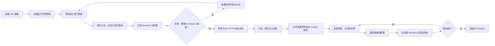

# Agent Hosting MVP 用户旅程与页面信息架构

> 状态：产品讨论稿
>
> 日期：2026-07-29
>
> 前提：企业内部多租户；租户独占 Kubernetes 集群；平台只接管已有集群；制品仅支持 OCI 镜像；协议为 HTTP/HTTPS + SSE；会话为尽力亲和。

## 1. 产品对象的用户语言

| 产品术语 | 用户理解 | 是否一级导航 |
|---|---|---|
| Agent 运行环境 | 一项持续运行并可被业务访问的 Agent 服务 | 是 |
| Revision | 一次不可变的镜像与运行配置快照 | 否，位于环境详情 |
| Agent 运行实例 | 实际承载请求的运行副本 | 否，位于环境详情，也可供运维全局查询 |
| Endpoint | Agent 的稳定访问入口及会话亲和配置 | 否，位于环境详情 |
| RuntimePlan | 平台提供的 CPU、内存、磁盘和运行约束套餐 | 管理员一级导航 |
| 资源池 / 集群 | 已注册的租户专属 Kubernetes 集群及其容量 | 管理员一级导航 |
| Ingress Profile | 谁可以从哪里调用 Agent，以及入口的 TLS、认证、限流和超时策略 | 否，普通用户只做选择 |
| Egress Profile | Agent 可以访问哪些模型、工具、数据和网络目标 | 否，普通用户只做选择 |
| SecureTaskProfile | Agent 将 Shell、浏览器、代码和文件处理等高风险短期任务委托给哪个企业安全沙箱策略 | 否，仅需要高风险工具的 Agent 选择 |
| 审计记录 | 用户、Agent 或平台系统产生的关键操作与策略决策证据 | 管理员可全局查询，环境内可局部查看 |

产品界面不向普通用户暴露 Deployment、ReplicaSet、Service、Ingress、Pod Template、requests/limits 等 Kubernetes 术语。

## 2. 目标用户

### Agent 开发工程师

完成镜像发布、参数配置、在线验证、版本更新和故障初查。最关心“能否快速部署、怎么调用、为什么失败”。

### Agent 应用负责人

决定规格、副本、访问方式和发布窗口，对环境可用性负责。最关心当前版本、运行容量、风险和回滚。

### 平台 / SRE

管理异常环境、实例、对账任务和平台告警。最关心跨租户健康、失败原因、操作记录和恢复入口。

### 资源池管理员

注册租户集群，维护标签和容量状态。最关心集群归属、可调度容量和放置失败。

### 网络、安全与 IAM 管理员

管理可被引用的域名、证书、网络 Profile、Secret 和工作负载身份。普通发布流程不应要求他们逐次手工参与。

### 安全运营与合规人员

查询控制面操作、访问链路、安全策略命中和高危动作，处理例外并向 SIEM 或审计系统导出证据。最关心“谁、在哪个身份上下文、依据哪条策略、执行了什么以及最终结果”。

## 3. 端到端业务旅程



### 旅程一：首次部署

1. 用户选择租户与项目。
2. 点击“创建运行环境”。
3. 填写名称、镜像、端口和 RuntimePlan。
4. 选择管理员预置的 Ingress Profile 与 Egress Profile；平台带入健康检查、日志、安全基线和会话亲和默认值。
5. 用户提交后立即得到环境 ID 和部署进度，而不是等待所有基础设施完成。
6. 平台依次展示：配置已接受、网络和身份策略生效、必需的 SecureTaskProfile 校验通过、工作负载创建、实例启动、健康检查通过、Endpoint 生效。
7. 成功后展示平台 HTTPS URL、调用示例和“测试调用”入口。

任一 Runtime 安全基线或网络策略未真实生效时，Endpoint 不进入 Ready，也不把实例注册到 LB；声明为必需的 SecureTaskProfile 校验失败时 Revision 部署失败。

### 旅程二：生产接入

1. 用户在测试调用页验证普通 HTTP 与 SSE 响应。
2. 客户端在请求头传递 `X-Agent-Session-ID`。
3. 平台说明同一键会尽量落到同一实例，但实例变化后允许重新映射。
4. 如需企业域名，用户在“访问与路由”页选择已有域名和证书资产，或发起外部申请。
5. 域名、证书和 LB 状态全部正常后，页面显示生产 URL。
6. 每个请求获得 Request ID；访问记录可关联到调用身份、Revision、实例和策略结果，正文默认不进入审计。

### 旅程三：更新与回滚

1. 用户编辑镜像或运行配置。
2. 页面展示配置差异。
3. 提交后生成新 Revision。
4. 新实例逐步就绪并加入 LB，旧实例先摘流再终止。
5. 发布页显示目标 Revision、当前进度、失败实例和日志。
6. 验证失败时，用户将环境期望 Revision 切回上一稳定版本。

### 旅程四：故障处理

1. 环境列表将异常区分为部署异常、实例异常、路由异常和容量不足。
2. 用户从环境详情进入实例或发布记录。
3. 实例抽屉展示 Revision、Pod、节点、IP、健康、重启次数和日志入口。
4. 用户可请求“重启实例”或“摘流并替换”；平台恢复期望副本数。
5. 平台/SRE 可查看对账滞后、LB 同步失败和集群不可达等平台级原因。

### 旅程五：停止与删除

1. 停止环境时，平台先从 LB 摘除端点，再将副本降为零；域名和配置保留。
2. 重新启动时复用原配置并产生新的运行实例。
3. 删除环境需要明确确认；平台按顺序清理路由、工作负载和账本，并保留审计记录。

## 4. 创建向导

建议采用“主路径少字段 + 高级配置折叠”的四步向导，而不是把 Kubernetes 参数平铺在一张长表单里。

### 第一步：基本信息

| 字段 | 必填 | 建议 |
|---|---:|---|
| 租户 / 项目 | 是 | 从当前身份上下文默认带入 |
| 环境名称 | 是 | 租户内唯一，创建后不建议修改 |
| 描述 | 否 | 说明 Agent 用途和负责人 |
| 标签 | 否 | 用于成本、团队和业务分类 |

### 第二步：镜像与运行

| 字段 | 必填 | 建议 |
|---|---:|---|
| OCI 镜像地址 | 是 | 支持选择企业镜像仓库或粘贴地址 |
| 镜像版本 | 是 | 页面可输入 Tag，发布时解析并固化 Digest |
| 镜像拉取凭证 | 条件必填 | 只选择 Secret 引用，不输入明文 |
| 容器端口 | 是 | 默认 8080，可修改 |
| RuntimePlan | 是 | 以套餐名称展示 CPU、内存、磁盘和限制 |
| 期望实例数 | 是 | MVP 手工设置 |
| Command / Args | 否 | 默认使用镜像 ENTRYPOINT/CMD，放在高级配置 |

### 第三步：配置与健康

| 字段 | 必填 | 建议 |
|---|---:|---|
| 普通环境变量 | 否 | 表格编辑与批量粘贴 |
| Secret 环境变量 | 否 | 选择 Secret、Key 和注入变量名 |
| 工作负载身份 Profile | 否 | 引用已有 Service Account / 云身份配置 |
| 健康检查路径 | 是 | 默认 `/health`，允许调整 |
| 初始延迟、间隔、超时、失败阈值 | 否 | 由 RuntimePlan 提供默认值 |
| 请求超时 | 是 | 应覆盖长耗时 Agent 请求 |
| 优雅终止时间 | 是 | 应大于 LB 摘除生效时间与典型 SSE 请求时间 |
| 日志 Profile | 否 | 默认使用平台日志 |
| Ingress Profile | 是 | 由管理员预置，统一入口身份、来源、TLS、限流和超时 |
| Egress Profile | 是 | 由管理员预置，控制可访问的模型、工具、数据和网络目标 |
| 工作负载安全基线 | 自动 | 生产环境强制启用，普通用户不可关闭 |
| SecureTaskProfile | 条件必填 | 仅当 Agent 声明需要 Shell、浏览器、代码或文件任务时选择；最长运行数小时 |

### 第四步：访问与确认

| 字段 | 必填 | 建议 |
|---|---:|---|
| Endpoint 可见性 | 是 | 内网为默认；公网若允许则需额外权限 |
| 平台域名 | 自动 | 平台自动生成并托管 HTTPS 证书 |
| 会话亲和 | 是 | 默认开启 Header 模式，也可关闭 |
| 会话 Header | 是 | 默认 `X-Agent-Session-ID` |
| 自定义域名 | 否 | 不阻塞首次部署，部署成功后也可绑定 |
| 证书引用 | 条件必填 | 仅自定义 HTTPS 域名需要 |
| 配置摘要 | 是 | 展示镜像 Digest、套餐、副本、网络和访问方式 |

## 5. 自定义参数是否需要

需要，但必须分层。

### MVP 应允许用户自定义

- 环境变量；
- Secret 引用；
- 镜像端口；
- 可选 Command / Args；
- 健康检查路径与少量阈值；
- 请求超时与优雅终止时间；
- 副本数；
- 会话 Header 名；
- 企业域名引用；
- 日志和身份 Profile 引用。
- Ingress 与 Egress Profile 引用。

### MVP 不应开放

- 任意 Kubernetes YAML；
- 任意 Pod Annotation 或 Label；
- 自定义 Scheduler 名称；
- hostNetwork、privileged、hostPath；
- 任意 Sidecar；
- 任意 Service、Ingress 或 LB 参数；
- 用户直接填写 kubeconfig、云 AK/SK、证书私钥；
- 任意伸缩表达式。

原则是让用户表达业务意图，让平台把意图翻译成基础设施配置。

## 6. 域名与证书

### 默认路径

首次部署不要求用户准备域名和证书。平台自动生成类似以下的 HTTPS 地址：

```text
https://{environment}.{tenant}.agents.internal.example.com
```

平台统一维护泛域名证书或由既有 LB/证书服务完成 TLS。

### 自定义域名路径

只有需要稳定品牌域名或既有业务域名时才配置：

1. 选择或输入域名；
2. 校验域名归属和 DNS；
3. 从企业证书服务选择证书引用；
4. 选择 Host/Path 绑定到目标 Endpoint；
5. 查看 DNS、证书、LB 和后端健康状态。

Agent Hosting 不保存用户粘贴的 PEM 私钥。如果现有 LB 服务已经负责证书，则平台只保存 `certificateRef` 或 `routeProfileId`。

## 7. 页面信息架构

### 普通用户导航

```text
概览
运行环境
  └─ 环境详情
     ├─ 总览
     ├─ 访问与测试
     ├─ 配置
     ├─ 实例
     ├─ Revision / 发布记录
     ├─ 日志与指标
     ├─ 安全与治理
     └─ 操作记录
```

### 管理员导航

```text
平台运营
  ├─ 全局环境与实例
  ├─ RuntimePlan
  ├─ 资源池 / 集群
  ├─ 对账与异常任务
  ├─ 审计中心
  ├─ 安全事件
  ├─ Profile 管理
  │  ├─ Ingress
  │  ├─ Egress
  │  ├─ Guardrail
  │  ├─ 身份
  │  ├─ 日志
  │  └─ 域名 / 证书引用
  └─ 策略覆盖与例外
```

## 8. 关键页面

### 概览页

回答“平台整体是否健康”：

- 环境总数及 Running、Deploying、Degraded、Stopped 分布；
- 就绪实例数与异常实例数；
- 最近发布成功率；
- 容量不足、集群不可达、LB 同步失败等告警；
- 最近操作和常用入口。

### 运行环境列表

建议列：

- 名称、项目、负责人；
- 综合状态；
- Endpoint；
- 当前 Revision；
- 就绪实例 / 期望实例；
- RuntimePlan；
- 目标集群；
- 最近更新时间；
- 快捷操作：详情、更新、停止。

### 环境详情总览

首屏必须立即回答：

1. 服务现在可用吗？
2. 业务该调用哪个 URL？
3. 当前运行哪个镜像和 Revision？
4. 有多少实例就绪？
5. 最近一次发布是否成功？
6. 失败时应该去哪里看？

顶部操作：测试调用、更新配置、调整副本、停止、回滚。

### 访问与测试

- 平台 URL 和自定义域名；
- 鉴权方式；
- 会话 Header 说明；
- curl / SDK 调用示例；
- 请求方法、路径、Header、Body 编辑；
- SSE 流式响应窗口；
- Request ID 和对应日志跳转。

### 实例页

列表字段：

- 实例 ID；
- 状态和健康；
- Revision；
- Pod / 节点 / IP；
- 创建时间与运行时长；
- 重启次数；
- CPU、内存；
- 操作：日志、指标、摘流并替换。

实例是环境期望状态的实际投影，不提供永久“创建单个实例”的入口。

### Revision 与发布记录

- Revision 号、镜像 Digest、创建人、时间和描述；
- 与上一 Revision 的配置差异；
- 发布状态和各阶段进度；
- 目标、就绪和失败实例数；
- 失败原因与日志；
- 回滚操作。

### 日志与指标

MVP 指标：

- 请求量、成功率、错误率；
- P50/P95/P99 延迟；
- SSE 活跃请求数或长请求数；
- CPU、内存；
- 就绪和异常实例；
- Revision 收敛耗时；
- LB 端点同步失败率。

日志至少可按时间、实例、Revision、Request ID 和会话 Header 值查询；是否记录实际会话键需要经过隐私与基数评估，可默认保存哈希值。

### 安全与治理

页面不平铺底层防火墙或 Kubernetes 规则，而是展示受管策略及其实际状态：

- Ingress Profile、调用方身份、可见性、域名、TLS 和限流摘要；
- Egress Profile、允许的目标类别、出站代理和最近拒绝；
- 长期 Runtime 安全基线及不合规项；
- SecureTaskProfile、最近 Task ID、任务状态和沙箱审计跳转；明确标注它只保护被委托的短期任务；
- 模型调用身份是否由网关代持、是否存在共享长期 API Key；
- Guardrail Profile 及观察、阻断或审批模式；MVP 没有接入语义护栏时明确显示“未配置”，不伪装成已保护；
- 最近访问、安全事件和高危操作；
- 从 Request ID 跳转到访问、Revision、实例、出站调用和安全决策。

审计中心按四种视图分开：操作审计、访问审计、安全事件和应用运行日志。平台目标是记录所有外部可观察且对业务或安全产生影响的操作，不记录模型思维链；Prompt 和响应正文默认关闭采集。

### RuntimePlan 页面

管理员维护：

- 套餐名称和说明；
- CPU、内存、临时磁盘；
- 可选副本范围；
- 并发与超时上限；
- 健康检查和优雅终止默认值；
- 可用资源类型和集群标签约束；
- 上架、下架和版本。

### 资源池 / 集群页面

管理员查看：

- 集群名称、租户、地域和状态；
- Kubernetes 版本和连接状态；
- CPU、内存、GPU 总量、已分配量和可用量；
- 环境和实例数量；
- 最后心跳和容量更新时间；
- 不可调度或不可达原因。

MVP 只注册和观察已有集群，不负责创建、升级或销毁。

## 9. 页面设计原则

- 默认值优先，普通部署不超过少量必填项。
- 先展示业务语义，再提供基础设施详情。
- 状态必须说明“现在发生了什么”和“用户能做什么”。
- 创建成功不等于已就绪；页面要显示异步部署进度。
- 敏感值只显示引用，不回显明文。
- 每次配置变更都形成可审计 Revision。
- 生产环境必须显示 Ingress、Egress 和安全基线是否真实生效，不能只显示用户的期望配置。
- 审计、安全事件和应用运行日志分开展示，但可通过统一关联 ID 互相跳转。
- 不提供 Session 列表，因为 MVP 没有 Session 领域资源。
